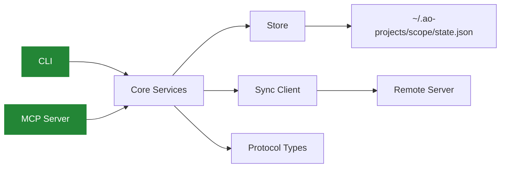

<div align="center">


<br/>

[](https://github.com/launchapp-dev/ao-projects)

<br/>


&nbsp;

&nbsp;

&nbsp;


</div>

<br/>

## What is ao-projects?

**ao-projects** is a standalone task and requirements manager designed for AI-driven development pipelines. It provides the project planning layer that agent orchestrators need — tasks, requirements, priorities, dependencies, checklists, and bidirectional traceability — as both a CLI and an MCP server.

```
                                ┌─────────────────┐
  Requirements ──────────────▶  │                 │  ──────▶ Tasks
  (draft → refine → plan)       │  ao-projects    │         (backlog → ready → done)
                                │                 │
  MCP Tools ◀───────────────── │  CLI + MCP +    │ ──────▶ Sync Server
  (15 typed tools)              │  Sync Client    │         (push/pull)
                                └─────────────────┘
```

Extracted from the [AO orchestrator](https://github.com/launchapp-dev/ao) — same data model, same wire format, zero dependencies on the daemon or workflow engine.

---

## Install

```bash
cargo install --git https://github.com/launchapp-dev/ao-projects ao-projects-cli
```

Or clone and build:

```bash
git clone https://github.com/launchapp-dev/ao-projects.git
cd ao-projects
cargo build --release
```

---

## Quick Start

```bash
# Create tasks
ao-projects task create --title "Add rate limiting" --priority high --task-type feature
ao-projects task create --title "Fix login timeout" --priority critical --task-type bugfix

# List by priority
ao-projects task list --priority high

# Move through statuses
ao-projects task status --id TASK-001 --status ready
ao-projects task status --id TASK-001 --status in-progress
ao-projects task status --id TASK-001 --status done

# Manage requirements
ao-projects req create --title "User authentication" --category security \
  --acceptance-criterion "Email/password login works" \
  --acceptance-criterion "Session persists across refresh"

ao-projects req refine --id REQ-001

# Check stats
ao-projects task stats --json
```

---

## MCP Server

Run as an MCP server for AI agents:

```json
{
  "mcpServers": {
    "ao-projects": {
      "command": "ao-projects-mcp",
      "env": {
        "AO_PROJECTS_ROOT": "/path/to/your/project"
      }
    }
  }
}
```

### 15 MCP Tools

<table>
<tr>
<td width="50%">

**Task Tools**

| Tool | Purpose |
|:---|:---|
| `projects.task.list` | Filter by status, priority, search |
| `projects.task.get` | Full task details |
| `projects.task.create` | Create with type, priority, tags |
| `projects.task.update` | Update fields |
| `projects.task.status` | Transition status |
| `projects.task.delete` | Remove task |
| `projects.task.stats` | Aggregate statistics |
| `projects.task.checklist-add` | Add checklist item |
| `projects.task.checklist-update` | Toggle completion |

</td>
<td width="50%">

**Requirement Tools**

| Tool | Purpose |
|:---|:---|
| `projects.req.list` | Filter by status, priority, category |
| `projects.req.get` | Full requirement details |
| `projects.req.create` | Create with acceptance criteria |
| `projects.req.update` | Update fields |
| `projects.req.delete` | Remove requirement |
| `projects.req.refine` | Move draft → refined |

</td>
</tr>
</table>

All tools call service methods directly — no subprocess overhead.

---

## Sync

Push and pull tasks/requirements to a remote sync server:

```bash
ao-projects sync setup --server https://your-sync-server.com --token <token>
ao-projects sync link --project-id <id>
ao-projects sync push    # send local state to server
ao-projects sync pull    # receive updates from server
ao-projects sync status  # check config and last sync time
```

---

## Data Model

<table>
<tr>
<td width="50%">

### Tasks

```
TASK-001
├── title, description
├── status: backlog → ready → in_progress → done
├── priority: critical | high | medium | low
├── type: feature | bugfix | refactor | docs | ...
├── assignee: agent { role, model } | human | unassigned
├── checklist: [ ] Step 1  [x] Step 2
├── dependencies: blocked_by TASK-002
├── linked_requirements: [REQ-001]
├── tags: ["frontend", "auth"]
└── metadata: created_at, version, dispatch_history
```

</td>
<td width="50%">

### Requirements

```
REQ-001
├── title, description, body
├── status: draft → refined → planned → done
├── priority: must | should | could | wont
├── type: product | functional | technical | ...
├── category: security | usability | runtime | ...
├── acceptance_criteria:
│   ├── AC1: Email/password login works
│   └── AC2: Session persists across refresh
├── linked_task_ids: [TASK-001, TASK-003]
├── comments: [{ author, content, phase }]
└── source: manual | vision | codebase
```

</td>
</tr>
</table>

### Bidirectional Linking

When you create a task with `--linked-requirement REQ-001`, both sides update:
- Task gets `linked_requirements: ["REQ-001"]`
- Requirement gets `linked_task_ids: ["TASK-001"]`

This traceability is the core value — every task traces back to a requirement, every requirement tracks its implementation.

---

## Architecture

```
2.6k lines of Rust · 5 crates

ao-projects-protocol ······ 500    Wire types, enums, filters, pagination
ao-projects-store ·········· 120   Atomic JSON I/O, scoped state paths
ao-projects-core ··········· 900   Services, state, sync client
ao-projects-cli ············ 600   CLI binary with task/req/sync commands
ao-projects-mcp ············ 400   MCP server (15 tools via rmcp)
```



---

## CLI Reference

```
ao-projects task
├── list          List tasks (--status, --priority, --search, --limit)
├── get           Get by ID (--id)
├── create        Create (--title, --priority, --task-type, --tag)
├── update        Update (--id, --title, --description, --priority)
├── status        Set status (--id, --status)
├── delete        Delete (--id)
├── stats         Aggregate statistics
├── checklist-add    Add item (--id, --description)
└── checklist-update Toggle item (--id, --item-id, --completed)

ao-projects requirements (alias: req)
├── list          List (--status, --priority, --category, --search)
├── get           Get by ID (--id)
├── create        Create (--title, --acceptance-criterion, --category)
├── update        Update (--id, --title, --status, --priority)
├── delete        Delete (--id)
└── refine        Draft → Refined (--id)

ao-projects sync
├── setup         Configure server (--server, --token)
├── link          Link to remote project (--project-id)
├── push          Push local state to server
├── pull          Pull updates from server
└── status        Show sync config
```

All commands support `--json` for machine-readable output.

---

## Using with AO

ao-projects was extracted from [AO](https://github.com/launchapp-dev/ao) and is wire-compatible. Add it as an MCP server in your `.mcp.json`:

```json
{
  "mcpServers": {
    "ao-projects": {
      "command": "ao-projects-mcp",
      "env": { "AO_PROJECTS_ROOT": "." }
    }
  }
}
```

AO agents can then use `projects.task.*` and `projects.req.*` tools alongside `ao.*` tools.

---

<div align="center">

<br/>

<sub>Extracted from <a href="https://github.com/launchapp-dev/ao">AO</a>. Built with Rust. MIT Licensed.</sub>

</div>


